# Console-VGA-Dongle-Series

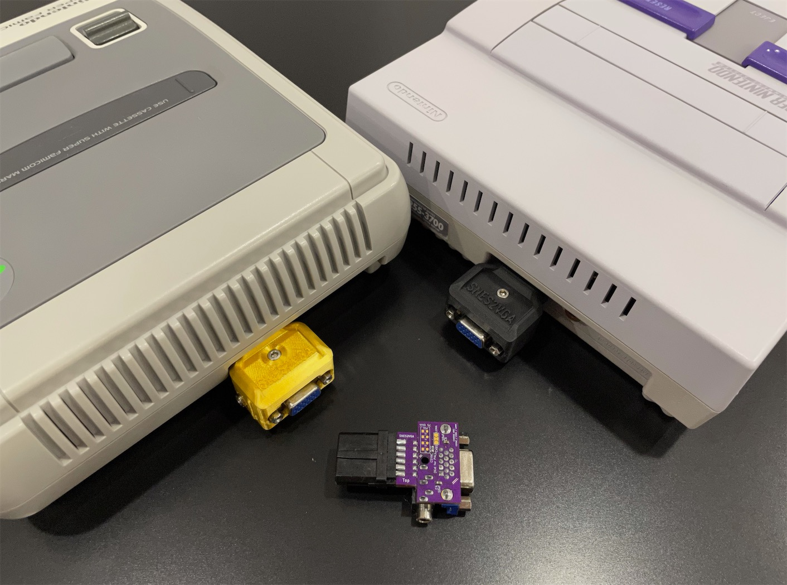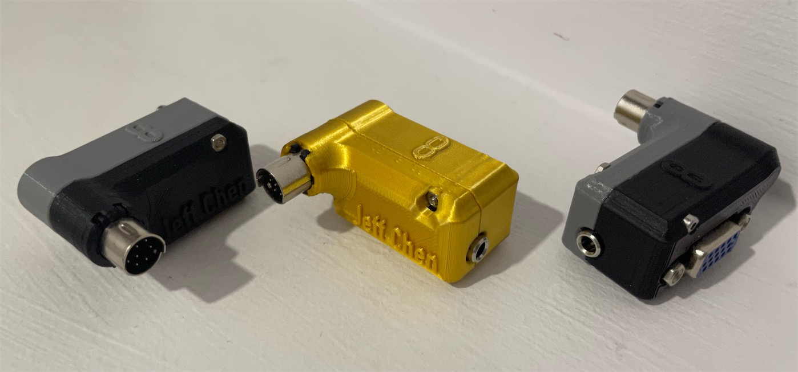

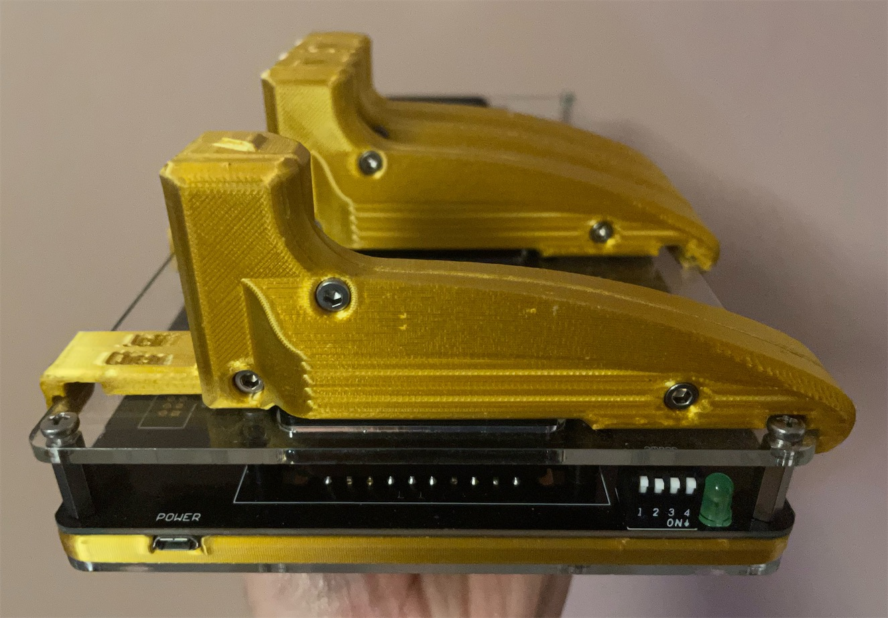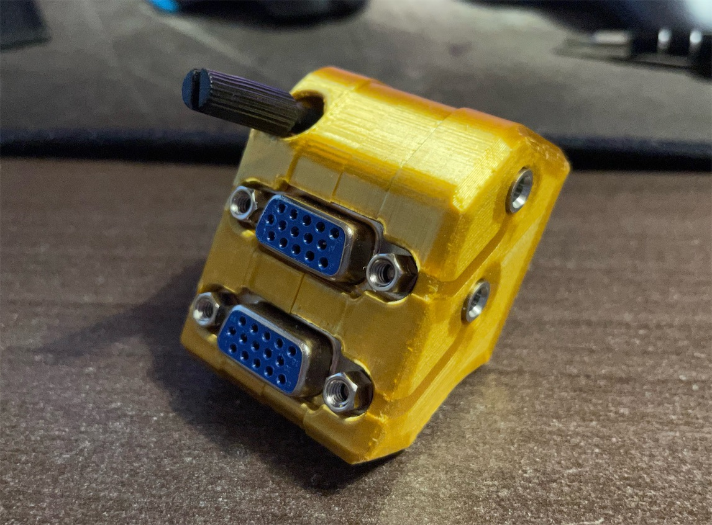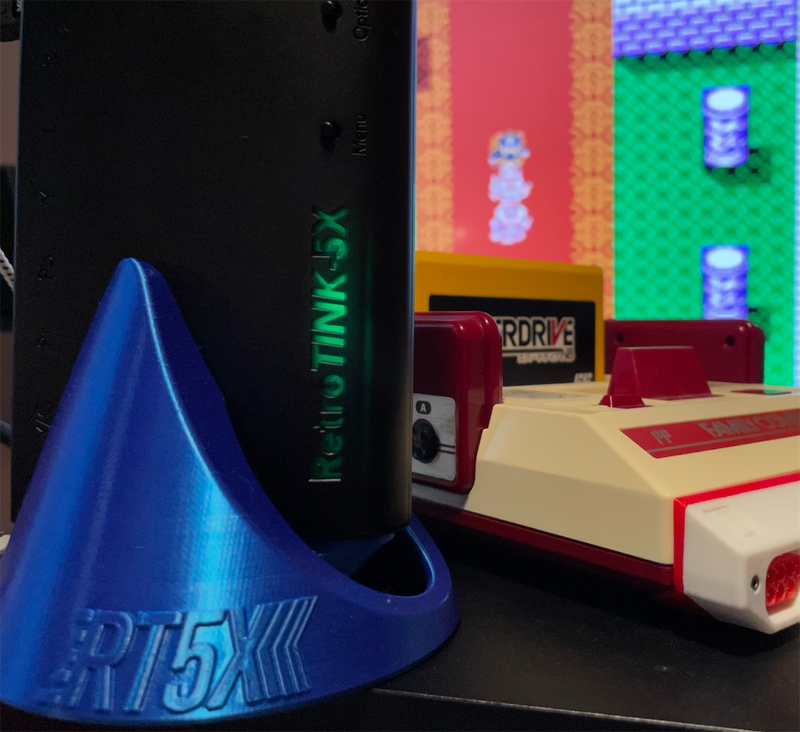

Everyone using the SCART cables for RGBS has had enough. They are inconsistent in quality, the plug is huge and unreliable, the audio buzzing drives you crazy.

In contrast, the physical connection for the VGA cable is much more reliable. You can easily extend the cable length with couplers. And they are cheap and readily available. But this only scratches the surface.

## Currently supported consoles
- Nintendo Famicom ([NESRGB](https://etim.net.au/nesrgb/), Mini DIN 8 pin)
- Nintendo AV Famicom/Super Famicom/Super NES (AV Multi/[Bypass mod](https://github.com/borti4938/SNES_RGB_Bypass))
- Nintendo 64 ([N64Digital](https://docs.pixelfx.co/N64Digital-Details.html), [N64RGB](https://etim.net.au/n64rgb/), [Simple RGB Mod](https://voultar.com/index.php?route=product/product&product_id=50), UltraHDMI)
- Nintendo GameCube ([GCDual](https://www.black-dog.tech/gcdual-5-3.html))
- 3DO ([3DORGB](https://github.com/citrus3000psi/3DORGB), Mini DIN 8 pin)

## Currently supported devices
- [RetroTINK 5X Pro](https://www.retrotink.com/product-page/5x-pro)
- [gscartsw](http://www.gretrostuff.com/store/gscartsw/)
- [Extron MVX VGA Switch](https://www.extron.com/VGA-Stereo-Audio-Matrix-Switchers/prodsubtype-136) (Check eBay for affordable listings)
- [VGAxSCART Bi-Directional Dongle](https://github.com/jeffqchen/VGAxSCART) for generic SCART devices

## Also works with
- [GBS Control](https://github.com/ramapcsx2/gbs-control)
- [OSSC](https://github.com/marqs85/ossc)

## To-do list:
- Sega Genesis/Mega Drive (Mini DIN 9 pin)
- PlayStation 1/2/3 (Sony AV Multi)
- Sega Saturn (Mini DIN 10 pin) (Might require drastic modding)

-----

## Some Technical Details

### Why VGA?

VGA cables are usually designed to an acceptable standard, with 3 coaxial mini cables for RGB channels, and shielding on the outside, with anti-interference ferrite cores on both ends. This is leagues better than the average SCART cables.

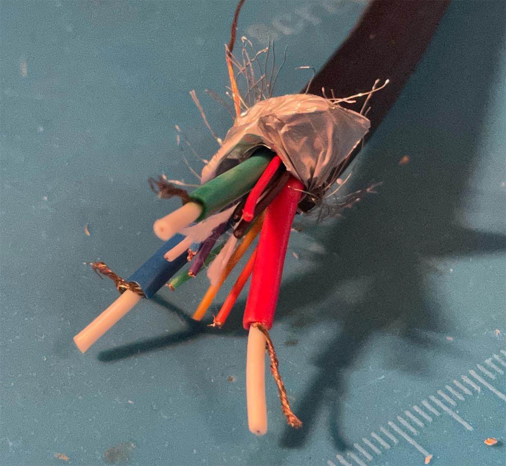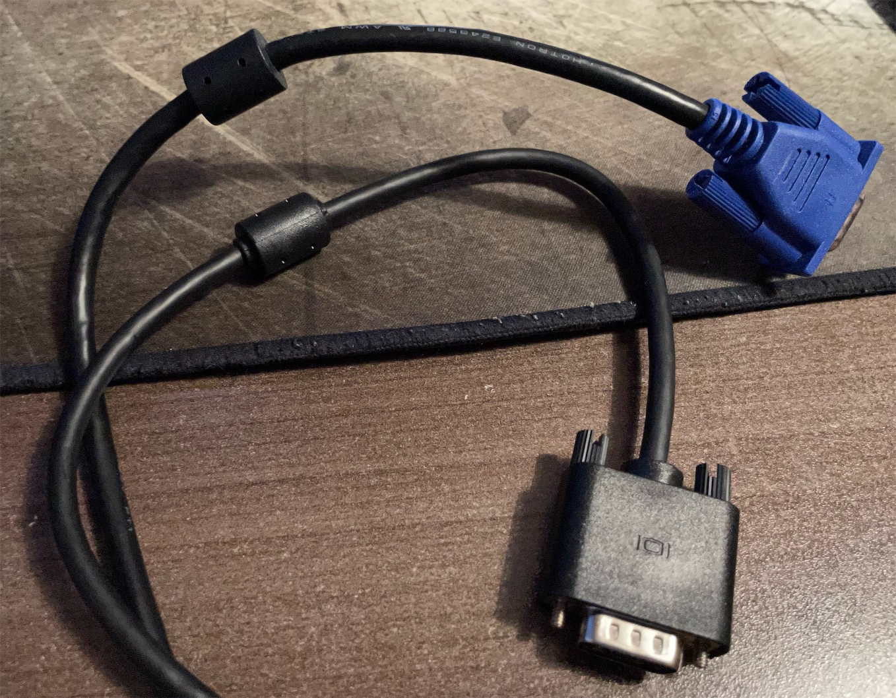

VGA cables have thumb screws to secure the physical connection to devices.

VGA cables can be easily spliced together with couplers that are not expensive. This makes it possible to create long cable runs with shorter cables at hand, or install as wall panels behind drywalls.

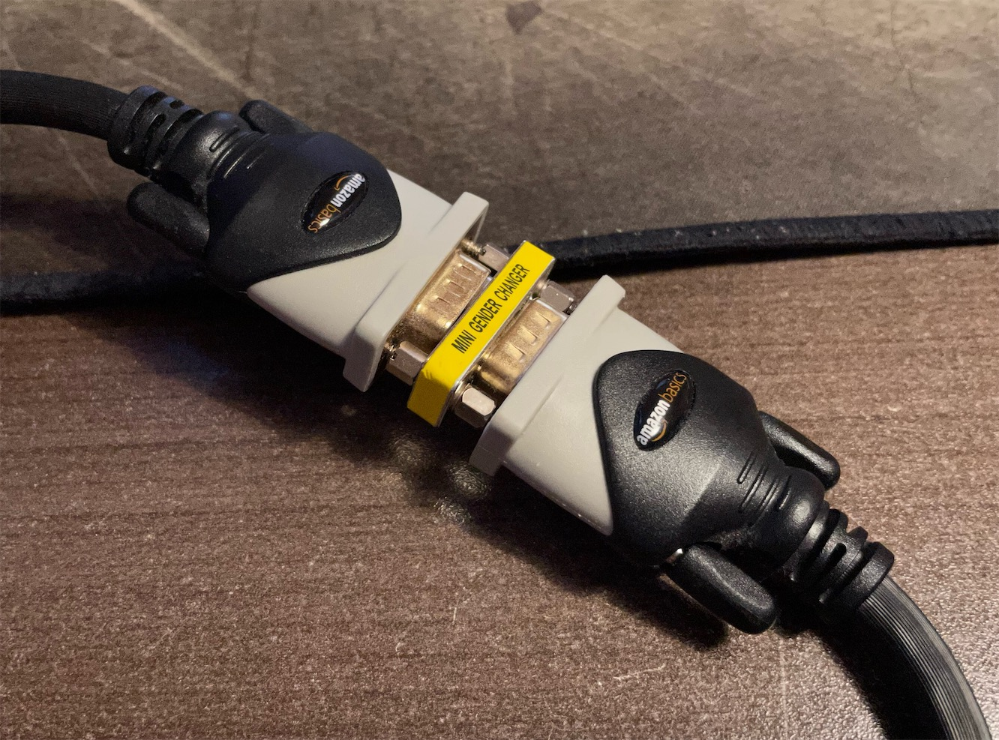

VGA cables are abundantly available. They are being phased out at the moment, therefore, it is quite easy to find them at dirt cheap prices.

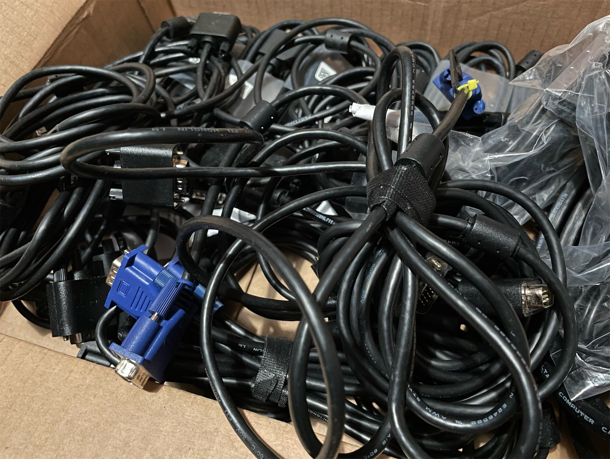

### Video

An ordinary VGA cable has 3 coaxial cables for RGB signals, as well as a bunch of other wires built in. I used the RGB channels as intended, as well as the horizontal sync (pin 13) for sync signal. This is one variation from the VGA pinout standards.

### Audio

Stereo audio runs through pin 12 (left) and pin 15 (right), with capacitors to isolate any possible DC voltage. This pinout makes sure the signals comply with ordinary VGA devices, so nothing would blow up if you accidentally plugged the other end into a standard VGA device.

Even though the RGB channels are well-shielded, the remaining unshielded sync line will still slightly couple into the the audio channels. With a normal 2-meter run, at normal hearing volume level, the buzzing noise is not audible. I experimented by connecting 5 of 2-meter VGA cables end to end with couplers, and the buzzing noise only finally became slightly audible.

With this in mind, I've decided to have a 3.5mm audio jack on the console side to enable audio breakout right at the source. You will be able to choose to carry the audio down the VGA cable by not using that jack. It's all about options.

### Components

For each of the console-side dongles, I have made sure necessary components were present.

For example, the SNES require two different sets of components for NTSC and PAL, and the PCB design took both into account, while providing various sync options. The 5V line from various consoles is also preserved, just in case the signal needs to be converted back to a SCART plug for terminal display devices.

### Why not RGBHV??

Many game consoles are capable of generating the RGB + CSync video signal, either natively or with some form of modding. If I were to convert all the CSync signals into HV, extra components would have to be introduced. This complicates the circuit designs and adds extra cost, while possibly affecting signal integrity. I would rather not to see this happening unnecessarily to ALL the devices in the circle.

Also, since sync lines inside VGA cables are usually not shielded, an extra sync line would become another source of noise, which would further cripple the audio quality.

With all the reasons above, I've decided to go with the RGB + CSync standard version of VGA pinout.

If a console outputs RGB+HV natively and exclusively, there will have to be a dongle to combine HV sync into CSync, in order to join the RGBS circle. This makes sure the extra complexity, cost and signal processing is only applied to these specific consoles, instead of every device.

If you wish to use RGBHV displays, you could use a sync separator, or various scan converters (RetroTINK 5X, OSSC, etc) to achieve the goal.

-----

## Links to the various released projects:

## Consoles

Nintendo consoles - SNES2VGA
- https://github.com/jeffqchen/SNES2VGA

8DIN2VGA
- https://github.com/jeffqchen/8DIN2VGA

## Devices

RetroTINK 5X SCART Dock
- https://github.com/jeffqchen/RetroTINK-5X-SCART-Dock

gscartsw2VGA
- https://github.com/jeffqchen/gscartsw2VGA

MVX Audio Separator/Combiner
- https://github.com/jeffqchen/MVX-Audio-Separator-Combiner

-----
## Suppliment Projects

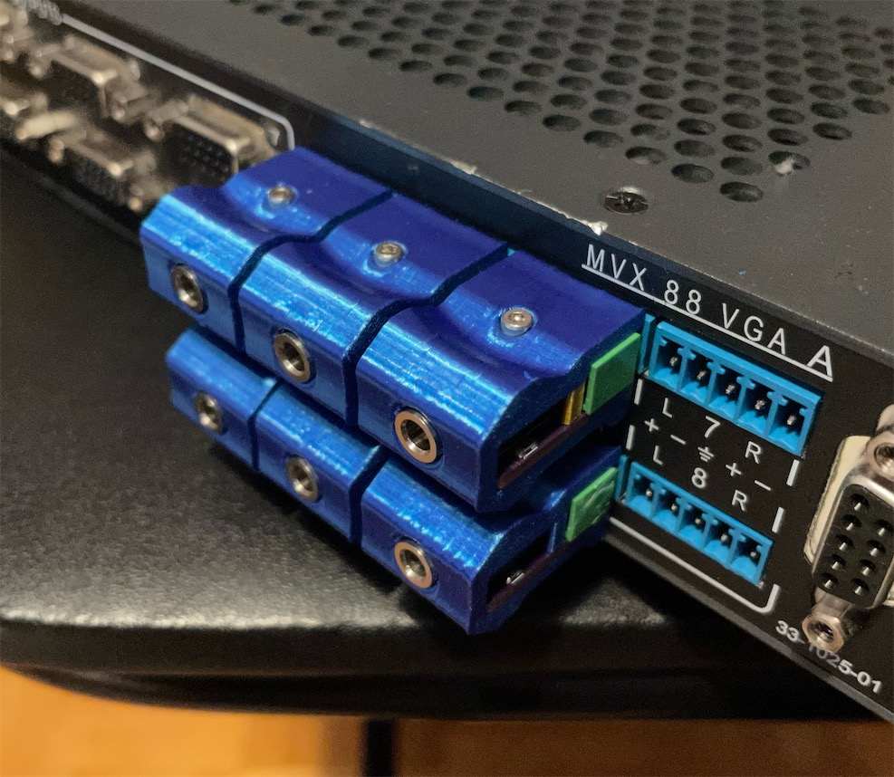

Extron Audio 3.5mm Adapter

- https://github.com/jeffqchen/Extron-Audio-3.5mm-Adapter

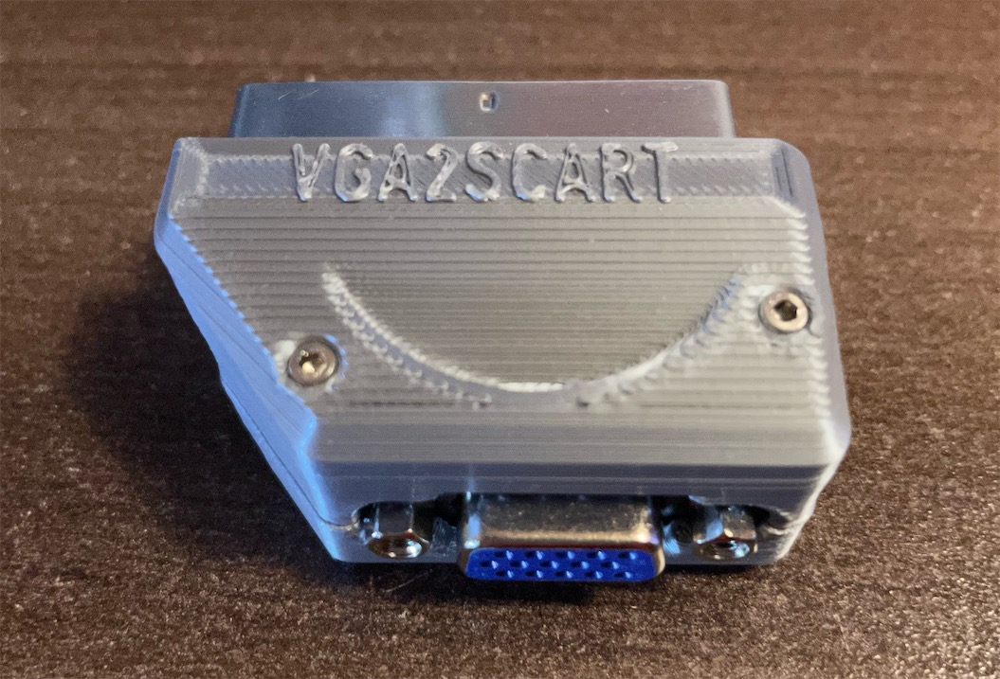

VGAxSCART Bi-Directional Dongle

- https://github.com/jeffqchen/VGAxSCART

-----
## Reasons for Involving Some of The Devices

### RetroTINK 5X Pro

One of the best video upscalers you could buy. Regrettably with a reversed SCART port. My dongle stand takes the SCART port and converts it into VGA, while providing a visually appealing dock for the device.

### gscartsw

This SCART switch has a great sync regeneration function. This alone makes it worthy to be included, since the PlayStation family does not output C-Sync and this could cause problem with video switches and capture devices.

### Extron MVX Switch
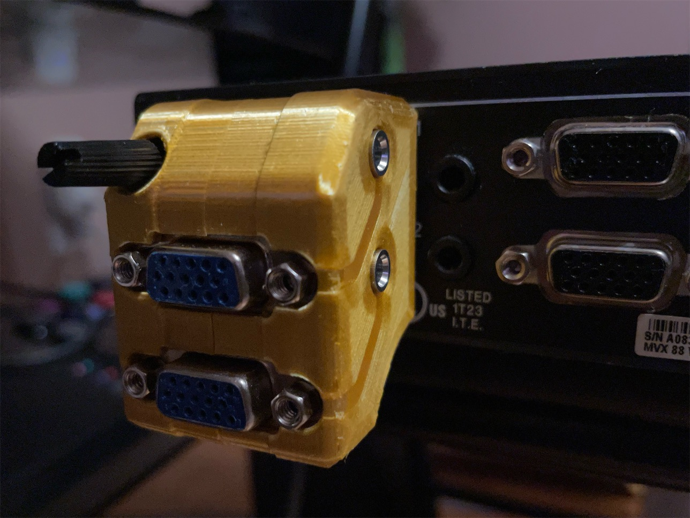

A very powerful video signal switch with audio support, that's actually very affordable. It's too good to pass up if you have a complicated setup.

-----

## Special Thanks

### RetroRGB (for all the available information regarding RGB)
- Website: https://www.retrorgb.com
- Twitter: https://twitter.com/RetroRGB

### Mike Chi (for the encouragements and technical details regarding the standard)
- Website: https://www.retrotink.com
- Twitter: https://twitter.com/retrotink2

### Javier Rodas (for the various EE-related suggestions)
- Twitter: https://twitter.com/JaviRodasG
